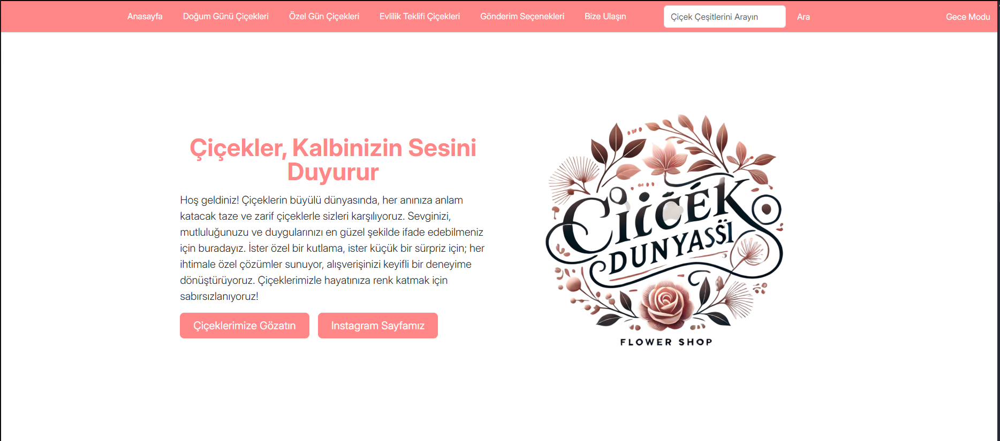
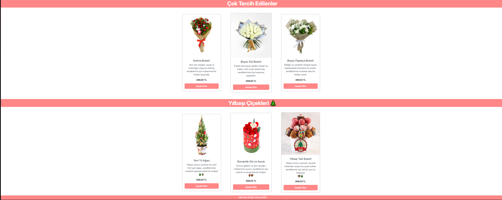
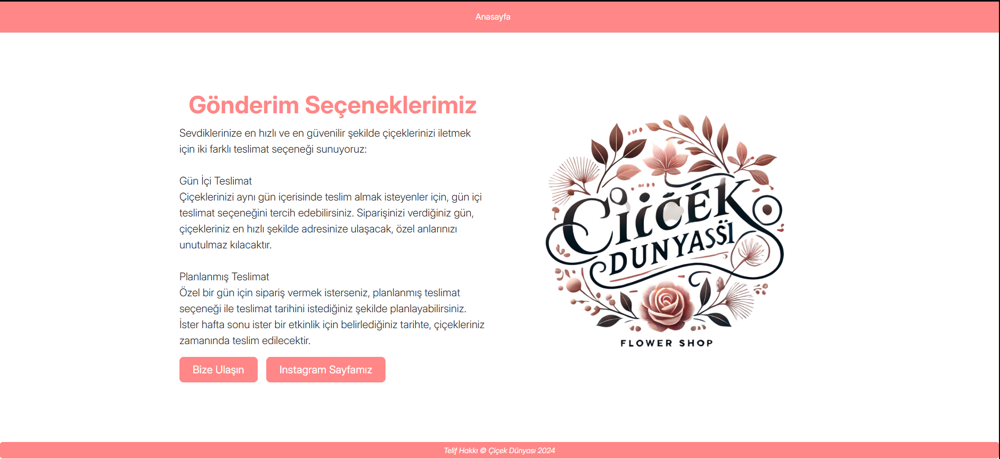

# 🌸 Çiçek Sipariş Web Sitesi

Bu proje, üniversite dönem sonu final ödevi kapsamında geliştirilmiştir. Tamamen eğitim amaçlı hazırlanmış olup, herhangi bir gerçek kurum veya kuruluşla bağlantısı yoktur.

## 🧾 Proje Hakkında

Web sitesi, çiçek satışı yapan bir platformun temel işleyişini simüle etmektedir. Kullanıcı dostu arayüzü mantığı üzerine kuruludur.

## 🖼️ Ekran Görüntüleri

### 🏠 Ana Sayfa


### 💐 Ürünler


### 🚚 Gönderim Seçenekleri



## ⚙️ Kullanılan Teknolojiler

- HTML5 / CSS3
- JavaScript
- Bootstrap 5


## ⚙️ 10 adet basit Javascript özelliği mevcuttur.
- Sayfa yüklendiğinde basit bir hoşgeldin mesajı atar.
- Bir ürünü sepete ekleyince bildirim gönderir.
- Arama kutusu boş bırakılırsa uyarı bildirimi gönderir.
- Footerin üstüne tıklayınca firmayla ilgili bir bildirim gönderir.
- Çiçeklere gözat butonuna bastıktan sonra sayfayı aşağıya kaydırır.
- Ürünün üzerine gelince cssteki hover gibi arkaplan rengi değişir.
- Ürünün üzerine gelince ürünün kutusunu transform kullanarak büyütür.
- Instagram sayfamız yazısı butonuna tıklayınca sizden onay almak için bir soru sorar.
- Sağ üstteki gece modu yazısına tıkladığınızda gece moduna geçerek arkaplanı değiştirir.
- Bir ürüne çift tıkladığınızda ürün favorilere eklendi diye bildirim gönderir.


## 📁 Kurulum

Projeyi kendi bilgisayarınızda çalıştırmak için:

```bash
git clone https://github.com/ahmetkavl/CicekDunyasiProje.git
